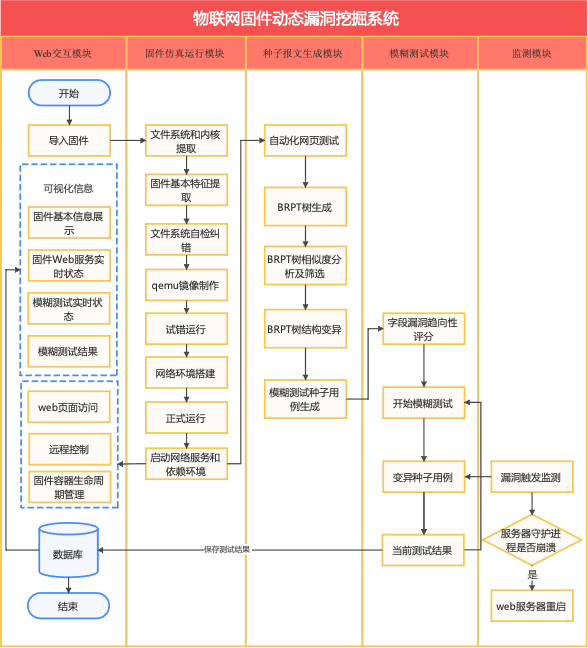
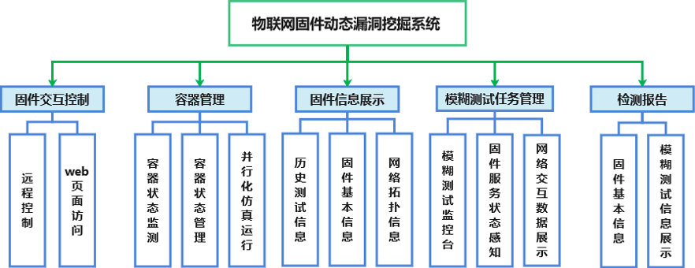
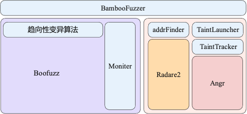
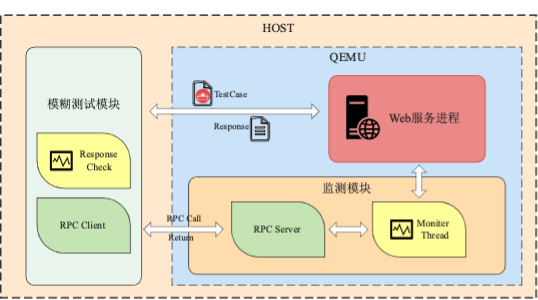
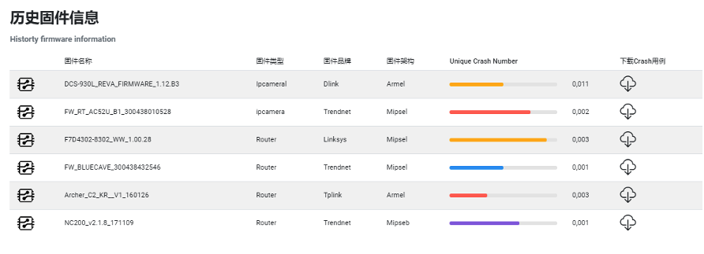
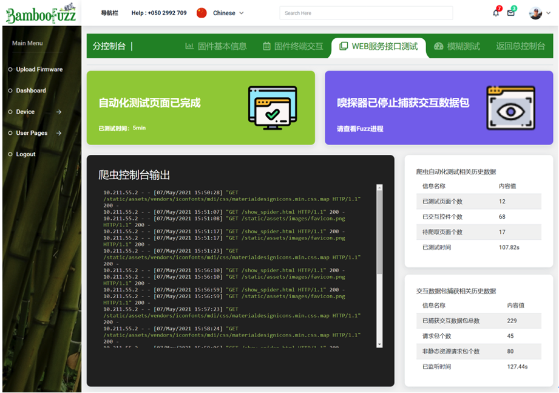

## BambooFuzz: 物联网固件动态漏洞挖掘系统

## BambooFuzz: An IoT Firmware Vulnerability Mining System based on Static and Dynamic Analysis

本作品从实际需求出发，对设备虚拟化、网络虚拟化、Dokcer容器技术、动态网络爬虫、数据包解析、污点分析、模糊测试等技术进行有机融合，**创新性地设计了****BambooFuzz：物联网固件动态漏洞挖掘系统，旨在建立了一个通用的大规模固件仿真运行和管理框架，并在此基础上构建一个以静态分析为导向的高测试效率、细监测粒度、自适应的模糊测试系统**。

## 0 系统设计 System Design

本项目主要分为五个模块，分别为Web交互模块、固件仿真运行模块、种子报文生成模块、模糊测试模块、监测模块。以下为各模块的具体作用，本系统总体流程设计下图所示。

+ **Web交互模块**，提供易于用户操作的Web平台。
+ **固件仿真模块**，负责搭建固件的仿真运行环境，执行固件仿真流程，确保用户提交的固件能够在通用的PC机环境下正常运行。
+ **种子报文生成模块**，负责生成符合前后端交互逻辑和语法规范的结构化模糊测试种子报文。
+ **模糊测试模块**， 用于驱动漏洞挖掘任务的进行，具体包括字段趋向性漏洞评分、种子报文变异、会话管理、数据存储等。
+ **监测模块**，负责对响应报文、服务器守护进程及其创建的子进程进行漏洞触发监测。

整个系统核心功能如下所示。

## 2 系统模块设计

### 2.1 固件仿真运行模块

负责对固件进行仿真运行并在固件启动完毕后对系统仿真环境的网络结构和固件的生命周期进行统一管理。我们根据IoT固件仿真运行的主要流程和后续管理策略将该模块划分为**静态提取与分析模块**、**自检纠错与镜像配置模块**、**固件启动与环境搭建模块**、**固件仿真管理模块**。

+ **静态提取与分析模块**负责从固件中提取出文件系统、系统内核，并对固件指令集架构、文件结构、网络服务类型、文件系统初始路径、文件系统列表、内核版本号等固件基本特征进行提取，为后续的仿真运行提供必要的信息。
+ **自检纠错与镜像配置模块**负责修复文件系统将其制成虚拟机启动所需的QEMU虚拟机镜像，并对固件启动的网络参数、网络设备和网络连接进行配置。
+ **固件启动与环境搭建模块**主要功能在于两方面，其一在IoT虚拟设备启动完成之后通过容器对其运行环境进行封装，利用Docker框架提供的网络管理策略，加强在多IoT设备并行挖掘场景下网络结构的拓展性，实现网络结构和网络配置的统一管理。其二在固件容器启动完毕后搭建必要的软件依赖环境，为模糊测试模块与监测模块打好基础。
+ **固件仿真管理模块**主要运用Docker容器生命周期管理对仿真运行设备集群进行统一管理。通过容器生命周期管理，从而实现对容器虚拟设备状态的监视，实现虚拟设备的创建，启动，停止，暂存等操作。同时通过访问控制列表防止用户在某一状态下对设备进行非法操作。

### 2.2 种子报文生成模块

种子报文生成模块负责对目标固件的Web通信接口进行扫描，获取若干正常交互过程的请求报文。使用BRPT树对报文进行反序列化解析，清洗筛选，相似度分析以及结构变异。最终将报文树序列化生成可直接用于模糊测试的高质量种子报文，如下图所示。

### 2.3 模糊测试模块

模糊测试模块作为整个系统的核心模块用于驱动整个测试的进行，具体包括字段趋向性漏洞评分、种子报文变异、会话管理、数据存储等。首先，模糊测试模块将对种子报文的各字段进行静态分析得到漏洞趋向性评分，进而确定各字段的变异方向及变异策略。在模糊测试主循环中，模糊测试测试引擎将与目标服务器建立会话，变异种子报文得到测试用例并发送该测试用例。每轮测试用例发送后，将从监测模块获取反馈信息，判断该轮测试用例是否触发漏洞。最终将当前测试用例、响应及监测信息存储至数据库。其中，具体变异策略包括长字符串扩展，特殊字符构建，字段置空，类型转换，复制扩展和路径穿越，根据字段的漏洞趋向性评分将被不同程度地应用。

模块实现的技术依赖如下图所示。

### 2.4 监测模块

监测模块是模糊测试中重要的一环。当模糊测试模块发送测试用例后，需要检测模块对目标进行监测并将监测信息进行反馈。此外，需要在测试开始、崩溃发生以及测试停止时，对目标分别进行启动、停止以及重启操作。为了更加有效地监测到漏洞的触发，我们对监测内容进行了拓展和细化。首先从监测对象上，我们从对单一的Web服务器进程监测拓展至对响应包内容、Web服务器进程以及其创建的所有子进程的监测。从监测内容上，我们增加了对进程管理类系统调用的监测。

## 3 项目界面展示

系统入口

固件上传页面

固件容器集群管理界面

固件历史信息展示

终端控制页面

网络爬虫监控展示

模糊测试控制界面

